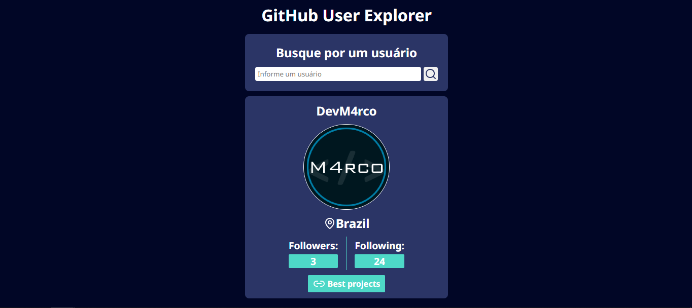
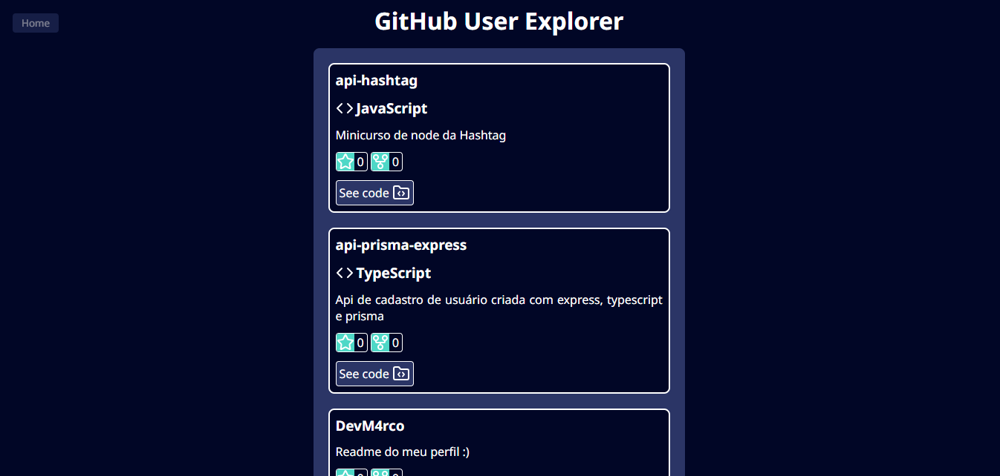

# GitHub Finder

Um aplicativo web para explorar perfis e repositórios de usuários do GitHub, construído com React, TypeScript e React Query. Inspirado no projeto do Matheus Battisti do canal Hora de Codar.

## 🚀 Funcionalidades

- Busca de usuários do GitHub por nome de usuário
- Visualização detalhada do perfil do usuário
- Lista dos melhores repositórios do usuário
- Navegação entre páginas usando React Router

## 🛠️ Tecnologias Utilizadas

- React - Biblioteca JavaScript para construção de interfaces
- TypeScript - Superset JavaScript com tipagem estática
- Axios - Cliente HTTP para realizar requisições à API
- React Query - Gerenciamento de estado e cache para dados assíncronos
- React Router DOM - Navegação e roteamento da aplicação
- Lucide React - Biblioteca de ícones
- GitHub API - API REST do GitHub para obtenção dos dados

## 🏃Como Executar

### Instalação

```bash
# Clone o repositório
git clone https://github.com/DevM4rco/github-finder.git
```

### Entre no diretório

```bash
cd github-finder
```

### Instale as dependências

```bash
npm install
```

### Execute o projeto

```bash
npm run dev
```

O aplicativo estará disponível em `http://localhost:5173`

## Estrutura do projeto

```
.
|-src/
|  |-components/
|  |-interfaces/
|  |-lib/
|  |-routes/
|  |-services/
|  |-App.css
|  |-App.tsx
|  |-index.css
|  |-main.tsx
|-index.html
```

## 🎯 Como Usar

- Acesse a aplicação através do navegador
- Digite o nome de usuário do GitHub que deseja pesquisar
- Visualize as informações do usuário na tela principal
- Clique no botão `Best projects` para ver os melhores projetos do usuário

## 🎨 Preview

|  |  |
| :---------------------------------------------: | :------------------------------------------------------: |
|    Formulário inicial de pesquisa de usuário    |            Principais repositórios do usuário            |

## 🙏 Agradecimentos

- Matheus Battisti do canal [Hora de Codar](https://www.youtube.com/@MatheusBattisti) pela inspiração
- GitHub pela excelente API
